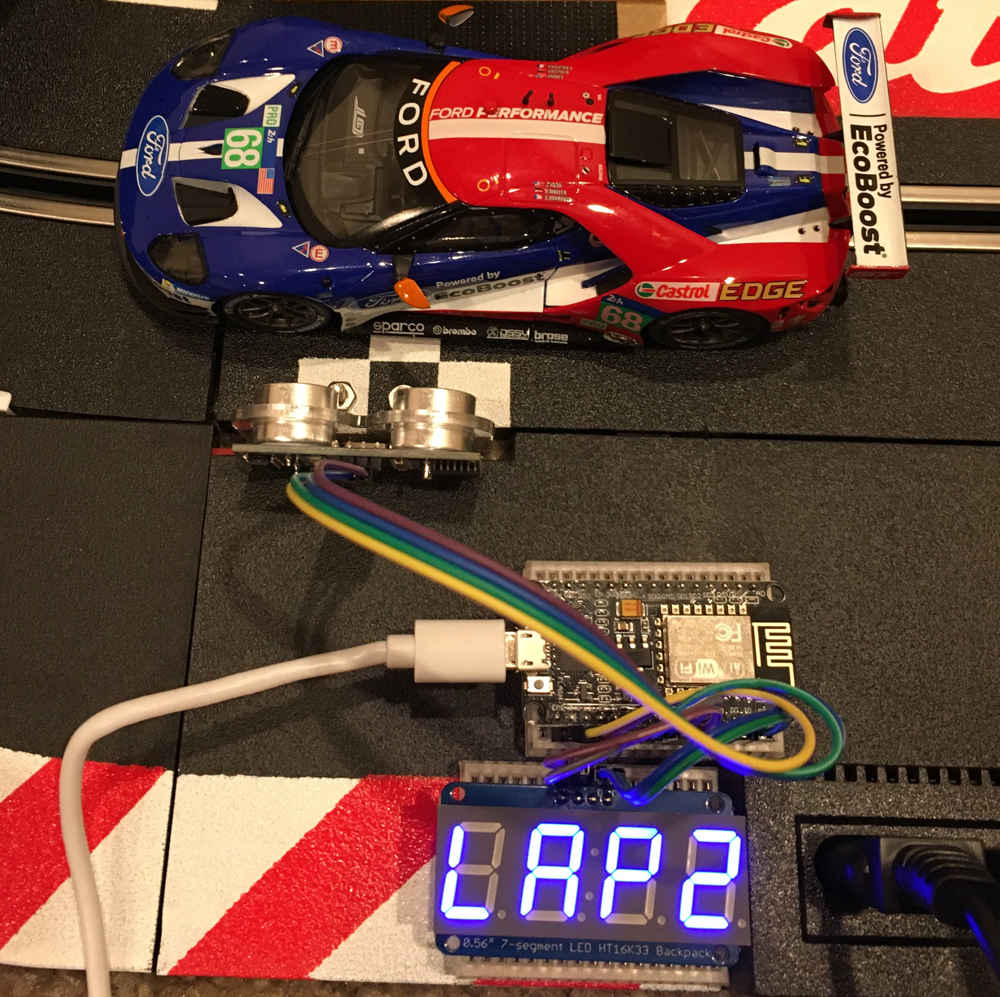
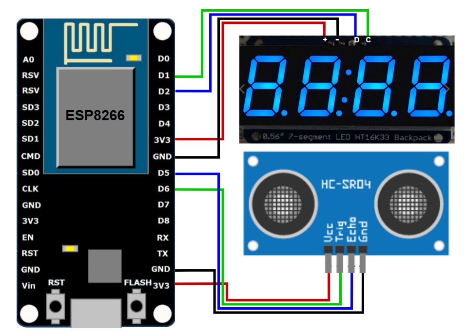

# LapTimer

This is a simple slot car lap timer that uses ultrasonic sensors and a numeric display and runs on Arduino. The lap timer displays the last lap time and lap count. 
I know you can just buy digital slot cars but they cost more than twice as much and hey, its fun to make stuff!

  </img>

## Components:
1. [ESP8226 board](https://www.amazon.com/gp/product/B010N1SPRK/ref=ppx_yo_dt_b_asin_title_o01_s00?ie=UTF8&psc=1)
1. [HC-SR04 ultrasonic distance sensor](https://www.amazon.com/gp/product/B07SC1YJ21/ref=ppx_yo_dt_b_search_asin_title?ie=UTF8&psc=1)
1. [Adafruit 0.56" 4-Digit 7-Segment Display w/I2C Backpack](https://www.adafruit.com/product/879)
4. [Power bank](https://www.microcenter.com/product/615771/inland-5,200mah-power-bank---black)
1. [Mini bread board](https://www.microcenter.com/product/481840/velleman-170-tie-points-mini-breadboards---4-pack)
6. Jumper wires (M-F & M-M)

## How it works
It's really simple: the distance sensor is used to check for the passing slot car. Lap times and counts are displayed at the end of each lap. 

  </img>

## Wiring Diagram

  </img>

